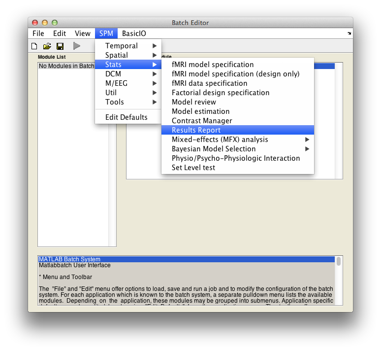
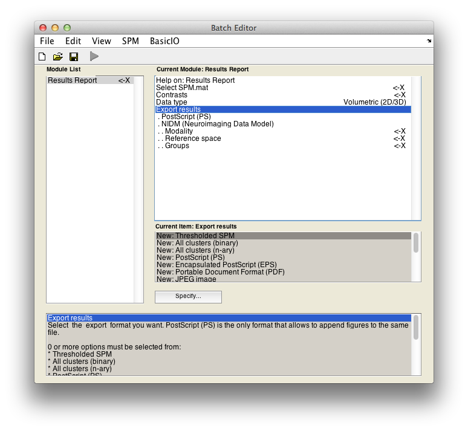

# NIDM-Results for SPM

Export mass-univariate neuroimaging results computed in SPM as NIDM-Results packs.

A *NIDM-Results pack* is a compressed file containing a NIDM-Results serialization and some or all of the referenced image data files in compliance with [NIDM-Results specification](http://nidm.nidash.org/specs/nidm-results.html).

##### Usage
1. In Matlab, open `SPM`

   ```
   spm fmri
   ```
1. Open the `Batch Editor` by clicking on the `Batch` button in the SPM12 `Menu` window
1. Open the menu `SPM` > `Stats` > `Results Report` (Fig. 1.)
3. In the batch window  (Fig. 2.)
  - Fill in information about the results you are interested in (in particular `SPM.mat` file, contrast number, threshold, etc.)
  - In `Export results`, selected `New: NIDM (Neuroimaging Data Model)`
  - Fill in information about your analysis (`Modality`, `Reference space`, `Groups`etc.``) 

            |  
:-------------------------:|:-------------------------:
 **Fig. 1.** Results report  |  **Fig. 2.** NIDM export
 
  
##### Requirements
  - [SPM12](http://www.fil.ion.ucl.ac.uk/spm/software/spm12/)

##### Installation
  - The latest version of the NIDM exporter in available in the last SPM release (v. xx)

##### Tests

Testing procedures for SPM NIDM-Results export.

Test data is available at https://github.com/incf-nidash/nidmresults-examples/, you will need a local copy of this repository stored with [git lfs](https://git-lfs.github.com/):
```
git clone https://github.com/incf-nidash/nidmresults-examples.git
git lfs install
```

To run the test battery, follow those steps:
 1. Add the test code to your matlab path:
 
 ```
 addpath(fullfile(<PATH_TO_EXPORTER>, '..'))
 ```
 1. Run the NIDM-Results export on your machine within Matlab (replace by `<PATH_TO_SPM_EXPORTER>` by the full path to your spm exporter and `<PATH_TO_EXAMPLES>` by the full path to the parent of the `nidmresults-examples` clone)

 ```
 nidm_export_all('<PATH_TO_EXAMPLES>/nidmresults-examples/', '<PATH_TO_SPM_EXPORTER>/spmexport')
 ``` 
 2. Push the updates turtle files to GitHub:

 ```
     git add -u
     git commit -m "description of updated feature"
     git push origin master
 ```
 3. Create a pull request and check out the test report created by Travis CI.
